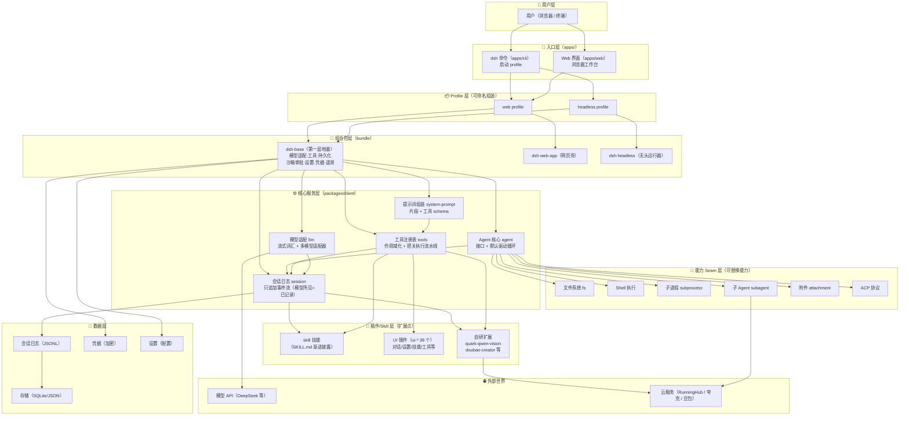

# DSH 架构图（DeepSeek Harness 自我认知）

> 来源：源码 `D:\AI\deepseek-harness-master`（docs/architecture.zh.md 等）
> 一句话：**DSH 是一棵"一切皆插件"的树**——每一部分（模型适配、工具、会话、Agent 本身）都是插件，挂在 Cordis 框架上，可替换、可重组。

## 🗺️ 架构总览（Mermaid）



## 📖 逐层人话说明

| 层 | 是什么 | 一句话 |
|---|---|---|
| **用户层** | 你 | 用浏览器开 Web 工作台，或终端跑命令 |
| **入口层** | apps/cli + apps/web | 两个入口：`dsh web`（图形界面）/ `dsh headless`（跑一次就退出）|
| **Profile 层** | web / headless | 给"图形"或"无头"各配一套插件清单，可自建新组合 |
| **组合包层** | dsh-base + 壳 | base 是第一层地基（模型/工具/存储/审批等都在里面），web-app 和 headless 是两种"外壳" |
| **核心服务层** | session / tools / agent / llm / prompt | 大脑：会话记日志、工具注册表把关、Agent 主循环、模型适配、提示词组装 |
| **能力 Seam 层** | fs / shell / subprocess / subagent 等 | 可替换的"器官"——换一个提供方，整个产品的这个能力就换掉（如远程沙箱）|
| **插件/Skill 层** | skill + ui-* + 自研 | 扩展点：新技能、新界面、新工具都在这挂载（我们的夸克/豆包 skill 就挂在这）|
| **数据层** | 会话日志 / 存储 / 凭据 / 设置 | 记忆与配置：日志只追加、凭据加密、设置可 patch |
| **外部世界** | 模型 API / 云服务 | DeepSeek 模型、RunningHub、夸克、豆包等 |

## 🔑 三个关键概念（不懂代码也能懂）

1. **一切皆插件**：连 Agent 主循环、会话日志都是插件——想换掉任何部分，挂个新插件覆盖即可，不需要改内核。
2. **分层叠加（patch 层）**：配置像千层饼：`基础组合包 → web壳 → 用户自己的补丁 → 临时补丁`，越上层越能覆盖下层。`dsh --dump-config` 能看到最终吃进去的完整配置。
3. **能力 Seam（可替换器官）**：文件系统、Shell、子进程这些能力都是"接口+实现"，换实现（如指向远程沙箱）整个产品跟着变——这就是"插件化"威力的来源。

## 🔄 一次对话怎么流转（轮次流程）

```
你发消息 → 会话记录 → Agent 组装提示词（含工具 schema）
  → 请求模型 → 模型回话/调用工具 → 工具执行（过审批/沙箱）
  → 结果写回日志 → 模型继续 → 直到轮次结束
```

## 🧩 我们的扩展挂在哪

| 扩展 | 挂载点 | 说明 |
|---|---|---|
| quark-qwen-vision | Skill 层（SKILL.md）| 夸克千问看图/生图（CDP 网页操作）|
| doubao-creator | Skill 层 | 豆包文生视频 |
| quark-harness-launcher | Skill 层 | 一键启动工作环境 |
| rh-workflow | Skill 层 + 外部云服务 | RunningHub H3 云端视频 |
| Obsidian 记忆库 | 外部数据 | Hermes 复盘沉淀（vault）|

## 📎 源码地图速查

- `apps/cli` — dsh 命令入口
- `apps/web` — Web 应用壳
- `packages/boot/app-boot` — profile 组装机制
- `packages/bundle/base|web-app|headless` — 三个组合包
- `packages/client/*` — 核心包（core/session、core/tools、core/agent、llm 等 + 38 个 ui-*）
- `packages/api/gateway` — API 网关
- `packages/acp` — Agent Client Protocol
- `docs/architecture.zh.md` — 官方架构文档（本图依据）
